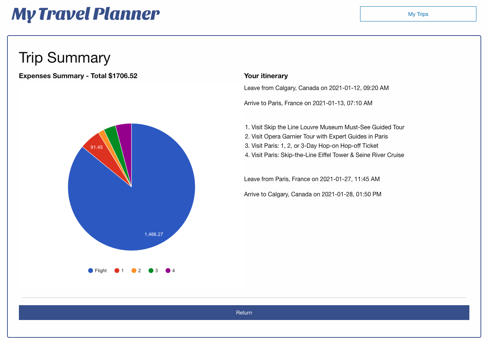

# My Travel Planner

A trip planning platform.

Link https://mich3ll3e.github.io/My-travel-planner-app/

# High-level description

My Travel Planner allows you to plan the most important aspects of your trips in a centralized location.

- Weather at the destination for the duration of the trip
- Available flights
- Activities and attractions to visit at the destination
- Budgeting and expenses distribution
- Itinerary

## How it works
As a tourist, I want to be able to conveniently plan the details of my trip. I would like to ensure that the weather at my destination is ideal for the adventures I wish to go on. I also would like to find flights that fit my timeline and budget. Additionally, I would like to have a list of all the activities I can choose to do at my destination, and an idea of how much each costs. With My Travel Planner, I can do all of that!

## Step 1
Enter current location and destination, as well as the start and end date of the trip.

## Step 2
Check out the local weather of the destination during the chosen timeline, and change the time period to find the ideal weather.

## Step 3
Choose from the selection of flights.

## Step 4
Brows through the list of activities that can be done at the destination; read the description of each and checkout the prices.

## Finally
Review the budget of the trip based on selected flight and activities, broken down in a pie chart.
Review detailed Itinerary.
Save the trip for easy access!

# APIs

## Weather

WorldWeatherOnline http://worldweatheronline.com

## Flight:

Amadeus: https://developers.amadeus.com

## Attractions

Amadeus: https://developers.amadeus.com

# Limitations

## Trip Destinations

Due to limitations in the free API, activities and attractions are available only to a limited number of cities.

